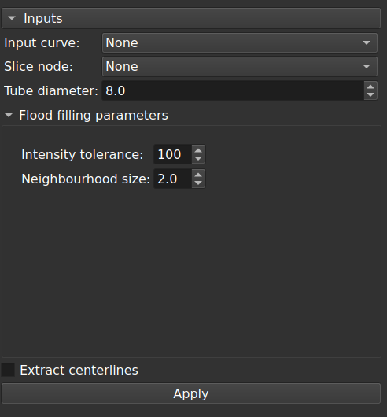

# CurveCenterlineExtraction module

This module is intended to create targeted segmentations from a contrast enhanced CT angioscan using a markups open curve, and to finally extract centerlines from the surface model. Overall, it's a small wrapper to create *short* arterial segments as *single* tubes, with subsequent centerline extraction.

It assumes that a markups curve control points are placed in the contrasted lumen.

The 'Flood filling' and 'Split volume' effects of the '[Segment editor extra effects](https://github.com/lassoan/SlicerSegmentEditorExtraEffects)' are used.

The '[Extract centerline](https://github.com/vmtk/SlicerExtension-VMTK/tree/master/ExtractCenterline/)' module is used for centerline extraction.

**Input markups curve node**

At least 3 control points are required. All control points must lie in the contrasted lumen, simulating the arterial axis. The first and last points will be endpoints to ‘Extract centerline’ module, and are not used for segmentation. It is therefore helpful that the second control point be reasonably close to the first point, and that the before last one be close to the last point. The input curve will be hidden if centerlines are requested.

**Input slice node**

The 'Flood filling' effect will be applied at each point in this slice view. The current offset will be changed consequently.

**Output segmentation node**

If no segmentation node is specified, one will be created, and it will persist across runs. An arbitrary segmentation node may also be provided. Segments will be added to the segmentation node, one for each input curve.

**Input tube diameter**

This value should be slightly greater than the maximum estimated diameter of the artery.

**Flood filling parameters**

Please refer to the manual of '[Segment editor extra effects](https://github.com/lassoan/SlicerSegmentEditorExtraEffects)' for their meaning. In brief, high values are needed for 'Intensity tolerance' with contrasted CT angiograms; increasing the value of 'Neighbourhood size' limits leakage during segmentation.

**Extract centerlines**

Check this to call the 'Extract centerline' module. It is optional by default because it make take much time, depending on the input surface. It is recommended to generate a segmentation first. Once it is considered reliable, generate a centerline model and a centerline curve as a last step.

**Notes**

If the centerlines are not extracted though the segmentation is good, interaction is required. Smoothing with ‘Fill holes’ at minimal kernel size helps to create centerlines (smoothing may be faster using the 3D brush). Afterwards, work should be continued directly in ‘Extract centerline’ module obviously.

