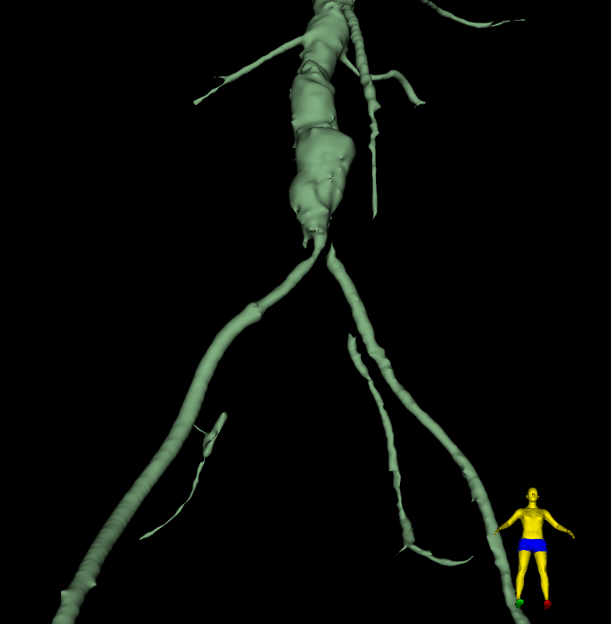
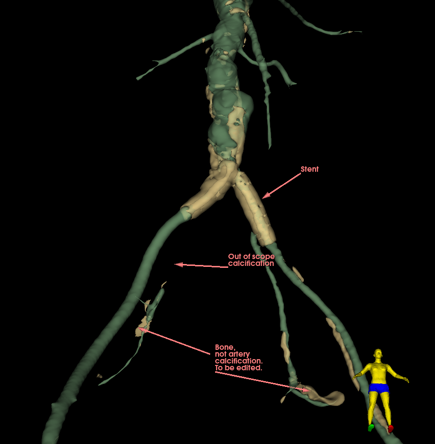
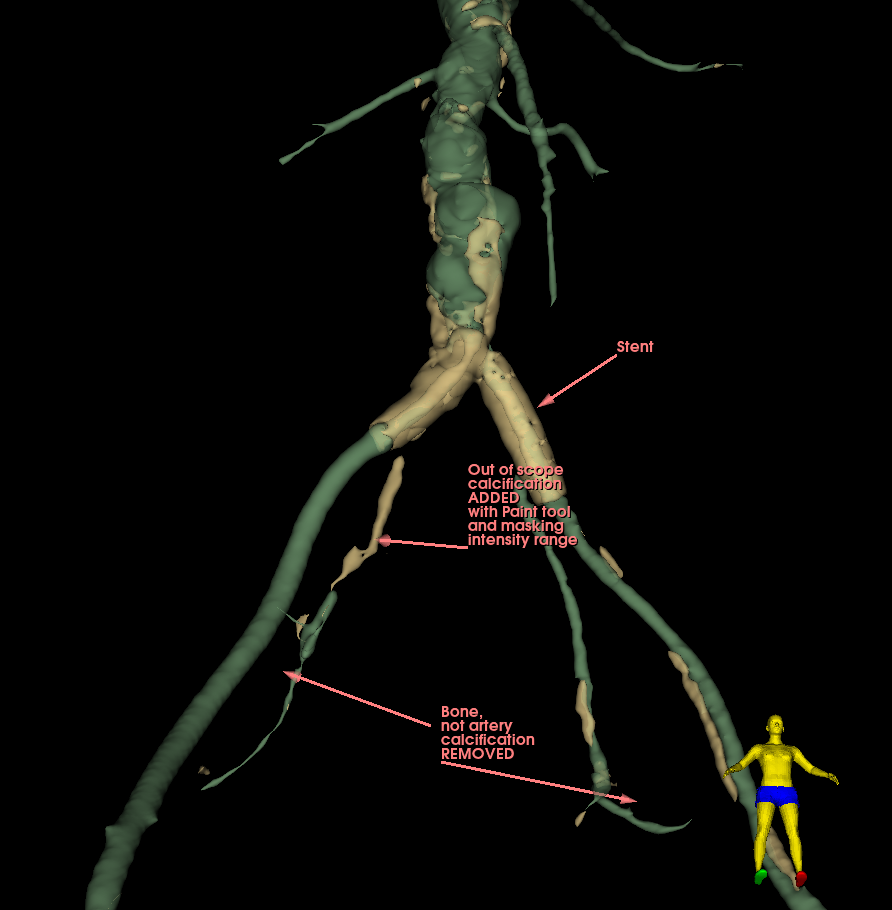

# Arterial calcification pre-processor

This module segments arterial calcifications within a specified distance around a lumen segment. Pre-process here implies that post-processing is almost always necessary.

### Usage

Segment an arterial lumen from a contrast enhanced CT scan by any means, from a diseased and calcified arterial tree. Select this segment and its source volume, choose an appropriate margin and apply.

### Post-processing

Bones that are within the margin around the lumen will be included. These are not wall calcifications, and may be removed using 'Islands / Remove selected island'.

Calcifications in an obliterated part of the artery may be missed. They can easily be segmented using the 'Paint' effect, while enabling the 'Editable intensity range' masking option. The range actually used during processing will be available.

These images illustrate the limitations of this approach.

---

**Lumen segment**

**Calcifications: good, missing and in excess**

**After editing**

---

**Notes**

- From the surgical perspective, this module gives a comprehensive global and focused view of what the surgeon will be dealing with.
- Targeted portions of a global segmented lumen and calcifications can be further defined using the 'Segment editor' effects, and passed to the 'Segment statistics' module for quantification.
- The quality of a segmented lumen is important. It must not contain holes.

