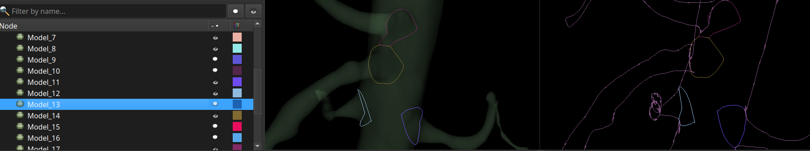

# Bifurcation profiles

This module highlights bifurcation profiles, i.e. the bifurcation splitting lines.

It requires a centerline model that must have been created with the 'Extract centerline' module, and the segmentation used to create the centerline.

### Usage

Select a centerline model node, the source segmentation and segment, and apply. The result can be browsed in the 'Models' module's widget.

Typically, 3 profile models are created from a simple bifurcation. Adjust the visibility of profiles of interest to suit a usage context.

### Disclaimer

Use at your own risks.
