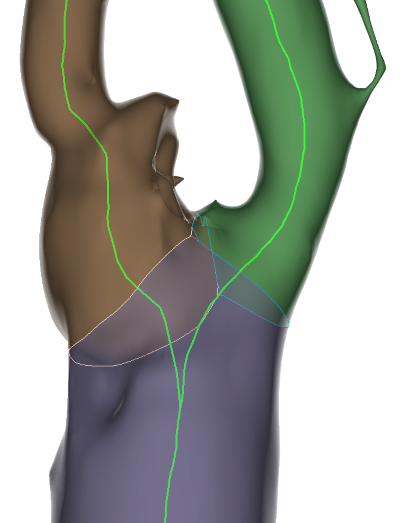

# Branch clipper

This module may split a bifurcated vascular segment into individual branches, given its centerline model. It may also create models of the splitting lines of bifurcations.

### Usage

Select a segment representing a vascular tree and its derived centerline. Specify whether branch segments and/or bifurcation profiles should be created.

The result will be one segment per branch, available in the segment editor. The bifurcation profiles are created as child nodes of the input centerline; they can be browsed in the widget of the 'Models' module.

### Notes

- The quality of the input segmented lumen is important. It must not contain holes.
- Limit the study to a targeted zone of interest since the processings may be time consuming.
- Typically, 3 profile models are created from a simple bifurcation. Adjust the visibility of profiles of interest to suit a usage context.

### Acknowledgement

This work is written by Saleem Edah-Tally (Surgeon) (Hobbyist developer) and integrated in SlicerVMTK by Andras Lasso (PerkLab).

