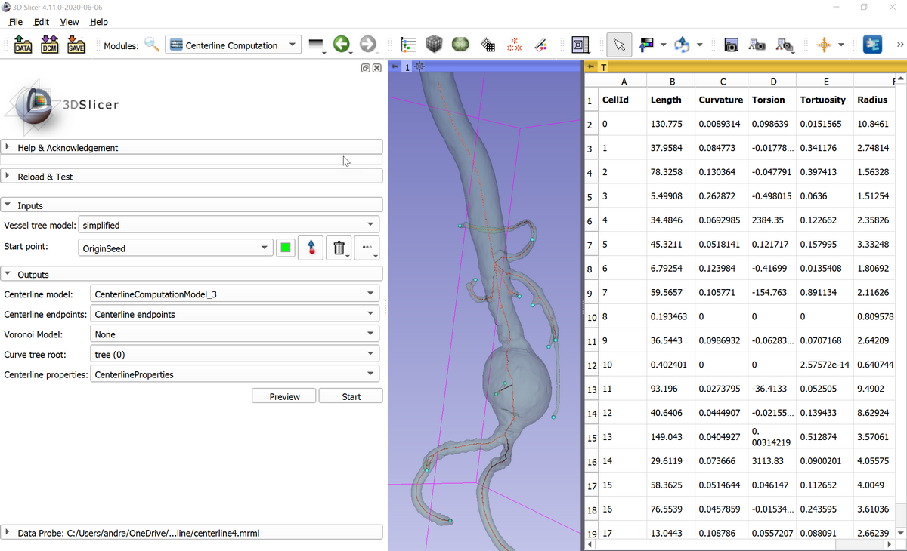

# Centerline Computation

*This module is replaced by the much improved, faster and more robust "Extract Centerline" module in current Slicer versions (Slicer-4.11 and later).*

This module determines centerlines in a vessel tree from an input model node. Click "Preview" button for a quick validation of the input model and approximate centerline computation. Click "Start" button for full network analysis and computation of all outputs.

Required inputs:
- Vessel tree model: this can be any tree structure (not just vascular tree but airways, etc.), either created in Segment Editor module or using Level Set Segmentation module. If Segment Editor is used then segmentation node must be exported to model node by right-clicking on the segmentation in Data module and selecting "Export visible segments to models".
- Start point: a markups fiducial node containing a single point, this should be placed at the branch of the tree

Outputs:
- Centerline model: network extraction results (without branch extraction and merging). Points contain centerline points, and "Radius" point data contains maximum inscribed sphere radius at each point.
- Centerline endpoints: Coordinates of found start point and all detected branch endpoints.
- Voronoi model (optional): medial surface of the input model (medial surface contains points that are qat equal distance from nearest surface points)
- Curve tree rool (optional): if a markups curve node is selected then a hierarchy of curve nodes are created from extracted and merged branches. CellId of each branch is saved into the node's name (and also as node attribute), which can be used for cross-referencing with CellId column of centerline properties table.
- Centerline properties (optional): if a table node is selected then branch length, average radius, curvature, torsion, and tortuosity is computed for all the extracted and merged branches.

