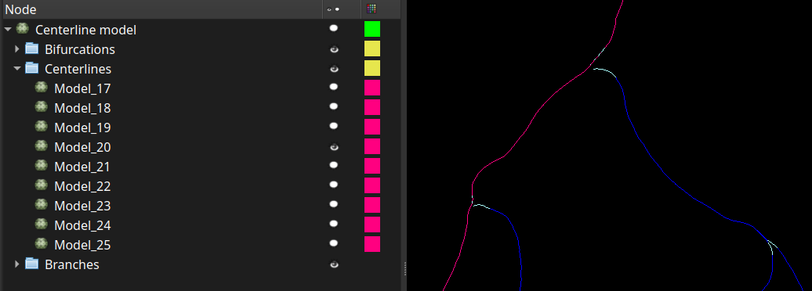

# Centerline disassembly

This module breaks down a bifurcated centerline model into parts.

The centerline must have been created with the 'Extract centerline' module.

### Usage

Select a centerline model node, the components to extract and apply. The result can be browsed in the 'Models' module's widget.

The components of a centerline can be:

      - bifurcation parts
      - branches, centerline parts that exclude the bifurcations
      - centerlines, i.e, one complete centerline from the first endpoint to every other endpoint.

### Disclaimer

Use at your own risks.
