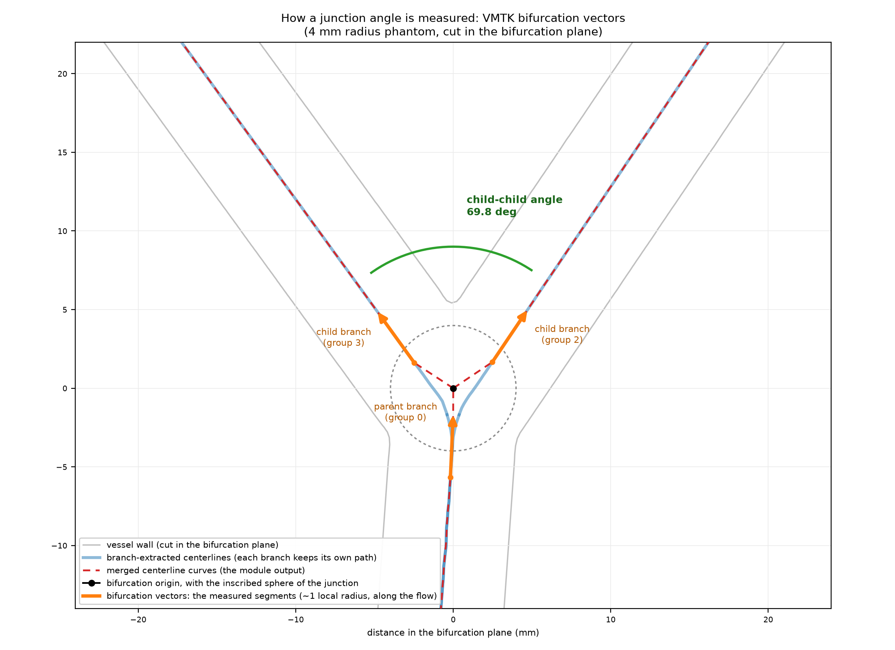

# Centerline junction angles

Select a centerline model produced by Extract Centerline, then click **Compute junction angles**. The module performs branch extraction internally and creates:

- a table with one row for every pair of branches of every bifurcation,
- a curve for each measured branch direction, in a 'vectors' folder,
- an angle markup for each pair of branches, in an 'annotations' folder, grouped by the type of the pair.

The measurement uses the bifurcation reference systems and the bifurcation vectors of VMTK, as the 'vmtkbifurcationreferencesystems' and 'vmtkbifurcationvectors' scripts do. For each bifurcation, VMTK computes a reference system: an origin, which is a radius weighted barycenter of the bifurcation, a bifurcation plane `Normal`, and an `UpNormal` that points from the parent branch towards the daughter branches. For each branch of the bifurcation, it computes a bifurcation vector: the end of the branch group that is next to the bifurcation region is taken, and the branch is walked away from the bifurcation up to the center of the first maximum inscribed sphere that touches that end point. The vector connects those two points, so its length is of the order of the local vessel radius.

Two properties of this definition are worth knowing. The vectors are computed on the branches, where each branch follows its own path through the bifurcation, and not on a merged centerline where the branches share a single trunk near the bifurcation: the measured angle is therefore the angle of the branches themselves. And the measurement distance follows the local vessel radius, so there is no scale to choose and the measurement behaves the same way in large and small vessels. On synthetic tubes whose axes meet at a known angle, it recovers the angle of the axes within about one degree, for vessel radii between 2 and 8 mm and independently of the branch lengths.

The vector of a branch is stored by VMTK along the flow direction, which means that the vector of the parent branch points towards the bifurcation. This module reverses it, so that all directions point away from the bifurcation and the angle of a pair of branches is directly the angle between the two directions, in the 0-180 degrees range: 180 degrees means that the two branches continue each other in a straight line. Note that the direction of a branch is measured just outside the bifurcation region, so for a branch that curves near the bifurcation it is not the same as the direction of the centerline at the bifurcation itself.

A branch is identified by its `GroupId`, from the internal branch extraction. Vector curves store this ID as a node attribute; angle annotations store the bifurcation and both branch IDs. Parent and child roles come from the upstream/downstream classification of VMTK, which follows the flow direction that was used for the centerline extraction. Parent-child angles use outward directions, so a straight continuation measures 180 degrees; the flow deflection is its supplement. Child-child angles describe the branching angle.

| Column | Description |
| --- | --- |
| `BifurcationGroupId` | `GroupId` of the internally extracted bifurcation |
| `JunctionDegree` | Number of branches that meet at the bifurcation |
| `JunctionPosition` | Origin of the bifurcation reference system (RAS) |
| `Branch1GroupId`, `Branch2GroupId` | `GroupId` of the two branches of the pair |
| `Branch1Role`, `Branch2Role` | `Parent` or `Child` |
| `AngleDegrees` | Angle between the outward directions of the two branches |
| `InPlaneAngleDegrees` | Angle of the pair projected onto the bifurcation plane. For a bifurcation whose branches are in one plane it is the same as `AngleDegrees`; the difference between the two shows how much of the angle is out of the bifurcation plane |
| `Branch1OutOfPlaneAngleDegrees`, `Branch2OutOfPlaneAngleDegrees` | Angle between each branch and the bifurcation plane |

All the pairs of branches of the table are annotated, which means that several angles are labelled at the same position at a bifurcation. The annotations are therefore grouped in a 'Child-child angles' and a 'Parent-child angles' folder, so that either group can be shown or hidden at once with the eye icon of the Data module. Child-child angles are yellow, parent-child angles are cyan.

An annotation is labelled with the angle value only, which is also its node name; the pair of branches it belongs to is told by its folder, its color, and its `Branch1GroupId` and `Branch2GroupId` attributes. Its rays are drawn several times longer than the measured segments so that they are readable next to the vessel: the angle depends on the directions of the rays only, and the bifurcation vector curves show over what distance each direction was measured.

The generated curves and angle markups are locked, since they are measurement results. Every run creates its own nodes and folders.
