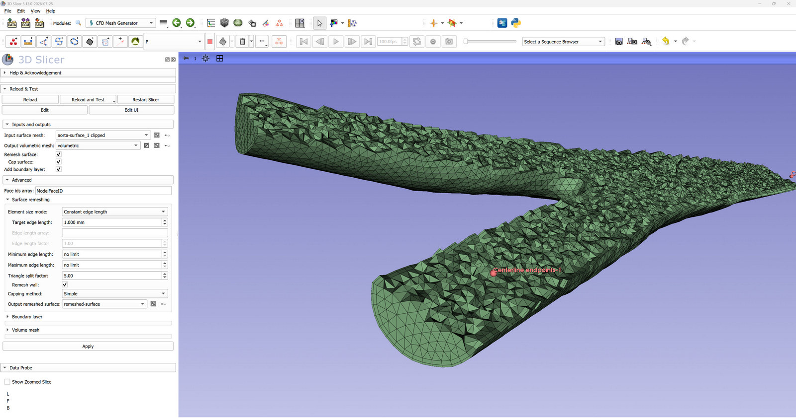

# CFD Mesh Generator

This module fills a vessel surface with tetrahedra, ready for a computational fluid dynamics solver. The input is a surface model - typically one that has come out of [Clip vessel](ClipVessel.md), with its ends cut normal to the centerline and its faces labeled. The output is a volumetric mesh, and optionally the remeshed surface the mesh was built on. This is the pipeline of VMTK's `vmtkmeshgenerator` script, with the same parameters.

**A volume mesh cut open with the clip button, to show the elements inside**

## What the module does
The surface goes through four steps, which the sections of the panel follow:

- *Cap surface* closes every open boundary with a cap of its own, each under its own id, so that a boundary condition can be assigned to it. A surface that is already closed does not need this; a surface left open cannot be filled with tetrahedra at all.
- *Remesh surface* retriangulates the surface into near equilateral cells of the target edge length. Turn it off only for a surface that is already meshed the way the solver wants it, because the size of the tetrahedra follows the size of the triangles they sit against. *Remesh wall* off remeshes the caps alone and leaves the wall exactly as it came in.
- *Add boundary layer* lines the wall on the inside with layers of prisms.
- The rest of the volume is filled with tetrahedra by the *Mesher* chosen, TetGen, fTetWild or Netgen. *Tetrahedralize* splits the prisms of the boundary layer too, for a solver that takes nothing else.

## Mesher
Three meshers fill the surface, and they answer differently shaped questions.

*TetGen* is handed the surface as a boundary it may not touch, and hands back the same triangles with tetrahedra behind them. The mesh meets the surface exactly, which is what a mesh built on a carefully prepared surface wants. A surface it cannot fill it fails on.

*fTetWild* is handed the surface as a shape to stay within *Surface tolerance* of, and meshes what it makes of it. The boundary comes back retriangulated and moved by up to that tolerance, and each face keeps its id by being matched to the face of the input nearest it. In exchange it fills surfaces TetGen refuses, and it sizes the elements by position: with *Element size mode* set to read an array, fTetWild grades the volume to match, as Netgen does, TetGen sizing it by one number throughout.

*Netgen* is asked TetGen's question and answers it with fTetWild's strengths. It keeps the surface it is given, triangle for triangle, so the mesh meets the surface exactly and a boundary layer swept from it joins the tetrahedra the way it does under TetGen; and it sizes the elements by position, so a surface graded by an array gets a volume graded to match. *Grading* says how fast the tetrahedra may grow away from the surface - 1 is as fast as they can, and a small value keeps the whole volume near the size of the finest part of the surface - and *Netgen optimization steps* is how many passes it spends improving the mesh once it has filled the surface. A surface it cannot fill it gives up on rather than crashing on, and the module says so. Netgen's own size setting is a loose bound on a surface handed to it as triangles, so the module scales what it hands over, and the tetrahedra come out the size TetGen's and fTetWild's do for the same target.

Netgen is not built into the extension either. It arrives as the `netgen-mesher` package, which the module offers to download from PyPI the first time Netgen is chosen; it has a wheel for every Python that Slicer runs on, so it is always installed into Slicer's own. Netgen is under the GNU Lesser General Public License 2.1, which carries none of TetGen's conditions on commercial use.

fTetWild is not built into the extension. It arrives as the `pytetwild` package, which the module offers to download from PyPI the first time fTetWild is chosen; this needs an internet connection and is done once. There is no package for Intel Macs. On an Apple silicon Mac running an Intel build of Slicer the module instead makes a Python environment of its own for it, beside the Slicer settings (under `CfdMeshGenerator/fTetWild`), the way SlicerSimVascular's SDF Stent module does: a virtual environment on the Mac's own Python run as arm64 - the Command Line Tools' `/usr/bin/python3`, a python.org install, or Homebrew's, the first of them that is Python 3.10 to 3.14 - with fTetWild installed into it. Where none of those is new enough, `uv` is installed into Slicer's Python and fetches an arm64 CPython to build the environment on. Either way this needs macOS 15 or later, which is what the package is built for. An environment set up by hand can be used instead by pointing the `SLICER_CFDMESHGENERATOR_FTETWILD_PYTHON` environment variable at its interpreter. TetGen is not always there either: its licence makes building it a decision, and where it was not built its entry cannot be chosen.

The other three fTetWild settings trade time for quality. *Stop energy* is how good the worst element has to be before it stops improving the mesh, 3 being a regular tetrahedron; *Optimization passes* caps how long it spends trying; *Coarsen* asks for the fewest elements the tolerance allows rather than the size asked for.

With a boundary layer, fTetWild takes a different route to the same result: the layer is swept inwards to say how much room to leave, the space inside is filled, and the layer that ends up in the mesh is grown back outwards from the boundary of those tetrahedra, so that its inner face is made of the very cells they are bounded by. The wall then sits where the outside of the layer lands, within about the thickness of the layer of where the surface was.

## Element size
*Target edge length* is the one number that says how fine the whole mesh comes out. The surface triangles aim for it, the thickness of the boundary layer is a fraction of it (*Thickness factor*), and the tetrahedra follow the triangles they sit against, scaled by *Volume element scale factor* - below 1 the volume mesh is finer than the surface it fills.

Element count grows with the cube of the size, so halving the edge length is about eight times the mesh: on a clipped aorta, 3 mm gives some 39 thousand tetrahedra, 1.5 mm some 106 thousand, and 1 mm some 411 thousand. Start coarse.

Set *Element size mode* to take the size from an array instead, and the target edge length is read per point from an array carried on the input surface, so the mesh can be made finer where the vessel is narrow. *Edge length factor* then scales the whole array at once, without recomputing it. The surface follows such an array whichever mesher is used; the volume behind it follows the array under fTetWild and Netgen, TetGen sizing it by one number throughout.

Asking the remesher for triangles far from the size of the ones the surface arrived with can leave it with holes, which no mesher can fill. fTetWild says so and stops rather than handing back a mesh of the part of the surface that was closed.

## Face ids
Every cell of the output carries an integer in the cell array named by *Face ids array*: one id for the wall, one for each cap, and 0 for the volume elements. This is what a solver reads the boundary conditions off - a different condition per inlet, outlet and wall.

The field takes several names separated by commas, and the first one the input surface carries is the one used; by default `CellEntityIds`, VMTK's own name, and `ModelFaceID`, the name SimVascular and its meshing tools read the faces of a model by and the one Clip Vessel writes. If the input surface carries one of the names, its ids are kept and any new caps are numbered above them, so a surface labeled by Clip Vessel arrives in the solver with the numbering it left Clip Vessel with. If it carries none of them, the faces of the input are renumbered from scratch under the first name. A surface labeled under some other name, and carrying no other integer cell array it could be labeled by, has that name put first when it is picked. The array is also what holds the faces apart while the surface is remeshed: the boundary between wall and cap stays where it is instead of being smoothed away.

## Cap ids array
*Cap ids array* names a cell array of the input surface that says which cells are caps: 1 or more on a cap, anything less on the wall (`CapID` by default, the name SimVascular's models carry). Where the surface has it, a face of the face ids array is a cap if its cells say so, and the wall may be numbered in as many faces as it likes - a model whose wall is five faces and whose caps are six more is read as five wall faces and six caps, and every one of those eleven ids reaches the mesh. Where it does not, the wall is face 1 and every face numbered above it is a cap, which is how Clip Vessel numbers them. Leave the field empty to go by the numbering alone.

Which faces are caps matters wherever the module treats the two differently: the caps are taken off a surface that arrives closed when the boundary layer is to stay off them, the caps are remeshed alone when the wall is to be left as it came, and the strips a boundary layer sweeps out at each vessel end are named after the cap they meet.

## Carried cell arrays
*Carried cell arrays* names cell arrays of the input surface, separated by commas, that are to arrive on the output as well. Each is carried face by face: every cell of the output that stands on a face of the input is given the value the input's cells on that face carry, and the volume elements - and any cap made by the module rather than brought in - are given -1. A face whose cells do not all carry the same value gets the value most of them carry, and the log says so.

This is for a surface whose ends are numbered by an array of its own, over and above the face ids - a `CapID` that gives one number to the inlet and another to every outlet, say, which a face id cannot express because each face has one id. The numbering arrives on the mesh on exactly the faces it was on, whatever the remesher made of the cells, because the faces are told apart by the face ids the whole way through. It also arrives on the remeshed surface.

## Boundary label arrays
*Boundary labels array* and *Point order array* name two point data arrays that say which vessel end each boundary point belongs to (`BoundaryLabels` and `BoundaryPointOrder` by default, the names the VMTK filters use and the ones [Clip vessel](ClipVessel.md) writes). A boundary's label is the face id of the cap that closes it: the two arrays and the face id array are one numbering, so the end labelled 3 in the point data is the face numbered 3 in the cell data, here and in Clip Vessel. Where the input surface carries them, each cap therefore comes out under the id its own end is known by - the same id every run, and the id Clip Vessel gave it. A point on no boundary carries -1, which is no face id at all. Where it does not, the caps are numbered in the order the boundaries happen to be found in, which can differ from one run to the next. The arrays are carried through the whole pipeline and are still on the output, so a mesh can be re-meshed with its ends identified the same way. Change the names only to match a surface whose arrays are called something else, or to keep out of the way of arrays of that name meaning something else.

## Boundary layer
The prisms along the wall are what resolve the velocity gradient there, and with it the wall shear stress; a mesh of tetrahedra alone needs to be far finer everywhere to say the same thing. *Number of sublayers*, *Sublayer ratio* and *Thickness factor* shape the layer - how many prisms, how their thickness grows away from the wall, and how thick the whole layer is relative to the target edge length.

*Layer on caps* is normally what an inlet or outlet boundary condition wants: turned off, the layer stops at the wall and each cap stays a single flat face with the flow meeting it directly, the caps being made past the layer, on the inner surface. A surface that arrives already capped has its caps taken off first and their ids put back on the ones made in their place, so the setting means the same thing whether or not the ends were closed before.

## Running
Apply runs the pipeline in a process of its own - a PythonSlicer started for the run, with the surface and the parameters handed to it in files and the mesh read back the same way - rather than in the application. Three things follow from that. The run can be stopped: while it goes the Apply button reads *Cancel*, and pressing it kills the process and keeps nothing of the run. A mesher that crashes, which TetGen does on a surface it cannot fill, takes that process rather than Slicer, and the module reports that it died along with the last of what it said. And fTetWild can be run in a Python other than Slicer's where Slicer's cannot host it, as above.

The steps of the pipeline are shown in the status bar as they start, and how long each took is written to the application log, together with everything the pipeline had to say - which array it read the faces from, what it warned about. Scripts calling the module's logic directly can still run the pipeline in their own process through `generateMesh()`; `process()` is what Apply calls.

## Looking at the result
Each node selector has buttons beside it that show or hide the node and turn its edges on and off, so a mesh can be checked without a trip to the Models module. The volume mesh has a third button that cuts it open: the first press puts a box through the middle of the mesh and clips to it, keeping whole elements, and the box can then be dragged and resized in the views. Pressing again turns the clipping off and on.

## Acknowledgement
This module wraps the mesh generation pipeline of the [Vascular Modeling Toolkit](http://www.vmtk.org), developed by Luca Antiga and David Steinman.

The volume mesh is generated by TetGen, by Hang Si, by fTetWild, or by Netgen.

TetGen is licensed under the terms of the MIT license with exceptions, one of which is that distribution of it for any commercial purpose is permissible only by direct arrangement with the copyright owner; for private, research and educational purposes it can be used at no cost and without further arrangements. Anyone putting this module to commercial use should read TetGen's license first.

fTetWild is ["Fast Tetrahedral Meshing in the Wild"](https://github.com/wildmeshing/fTetWild), by Yixin Hu, Teseo Schneider, Bolun Wang, Denis Zorin and Daniele Panozzo (ACM Transactions on Graphics 39(4), SIGGRAPH 2020), under the Mozilla Public License 2.0. It is used through the [pytetwild](https://github.com/pyvista/pytetwild) package of the PyVista project.

[Netgen](https://github.com/NGSolve/netgen) is the mesh generator of Joachim Schöberl and the NGSolve project, under the GNU Lesser General Public License 2.1. It is used through the `netgen-mesher` package.
