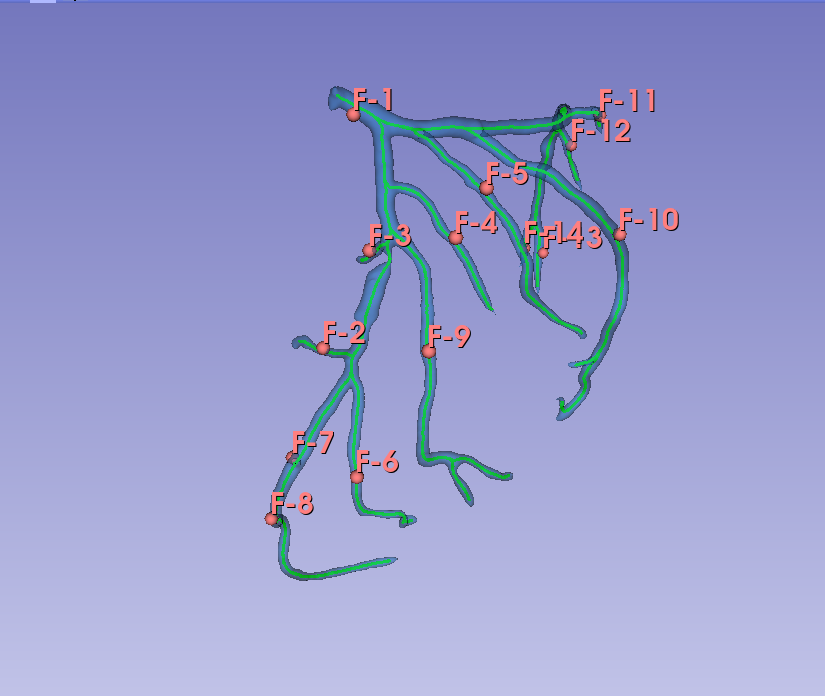
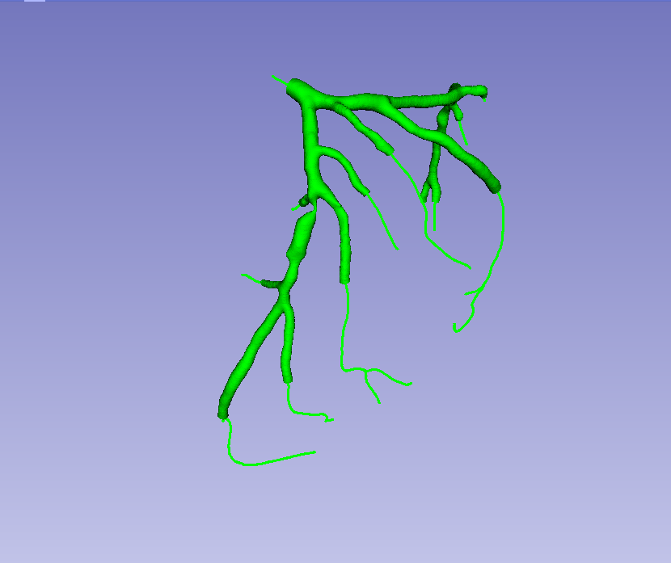
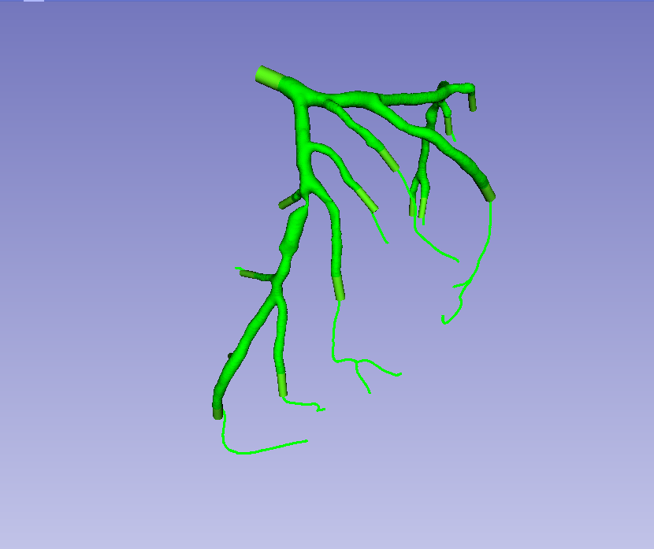

# Clip Vessel
This module serves to clip or truncate a vessel based on user provider points. The user must provide a surface as input (in either model or segmentation format) as well as vessel centerlines created by the VMTK module [**ExtractCenterline**.](https://github.com/vmtk/SlicerExtension-VMTK/blob/master/Docs/ExtractCenterline.md). All branches/vessels should contain a centerline otherwise the clipping may produce undesired geometries in regions without a centerline.  Finally, the user must provide a list of fiducial points that represent where the model will be clipped. The first point is assumed to be the vessel inlet and will clip accordingly. If the output model needs to be capped this can be triggered by the checkbox. The module outputs the clipped surface.

**Placement of markup points to define clipping locations**

**Clipped vessel**

## Advanced
Advanced options include preprocessing of the input surface and the addition of flow extensions.
Refer to [here](https://github.com/vmtk/SlicerExtension-VMTK/blob/master/Docs/ExtractCenterline.md#:~:text=Extract%20centerline-,Preprocessing,-The%20module%20requires) for preprocessing options related to the input surface. When creating flow extensions the user can control the extension length (in mm) as well as the extension mode. The original outlet is transitioned to a circular outlet over the length of the extension.

**Clipped vessel with flow extensions**

## Acknowledgement
This module has been contributed by David Molony and is heavily based on the ExtractCenterline module.