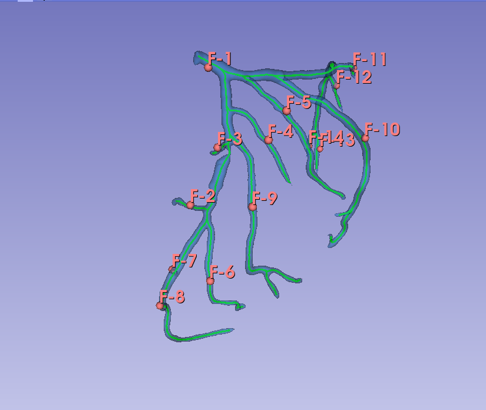
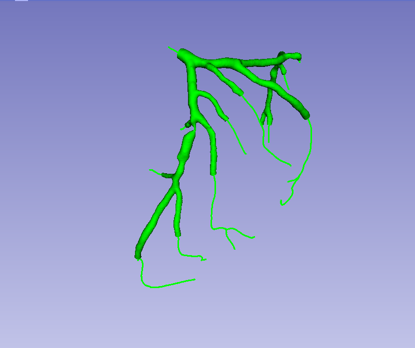
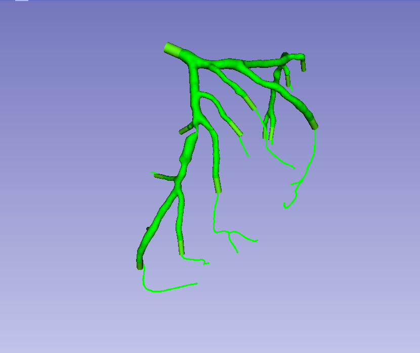

# Clip Vessel
This module serves to clip or truncate a vessel based on user provider points. The user must provide a surface as input (in either model or segmentation format) as well as vessel centerlines created by the VMTK module [**ExtractCenterline**.](https://github.com/vmtk/SlicerExtension-VMTK/blob/master/Docs/ExtractCenterline.md). All branches/vessels should contain a centerline otherwise the clipping may produce undesired geometries in regions without a centerline.  Finally, the user must provide a list of fiducial points that represent where the model will be clipped. The first point is assumed to be the vessel inlet and will clip accordingly. If the output model needs to be capped this can be triggered by the checkbox. The module outputs the clipped surface.

## Labeling the faces
Enable *label mesh faces* to have the module tag every triangle of the output surface with an integer face id, stored in a cell array whose name can be set next to the checkbox (`ModelFaceID` by default, the name that SimVascular and its meshing tools read the faces of a model by). The vessel wall - including any flow extensions grown from it - gets id 1, and each cap gets its own id: the cap of the Nth clip point gets id N+1, so the inlet cap is 2, the cap of the second clip point is 3, and so on. If the input surface already carries face labels of its own, those are kept as faces in their own right: they are renumbered onto 1, 2, 3... in ascending order of their original id (a lone pre-existing face at id 10 becomes 1), the vessel wall takes the next id after them, and the caps follow the wall as before - so a pre-existing patch at id 10 gives face 1 for the patch, 2 for the wall and 3 for the first cap. A cell that the input left unlabeled (id 0 or below) counts as wall. If the input labels every cell, so that there is no wall of its own to label, no id is set aside for one and the caps follow the renumbered faces directly. Capping also closes any hole that no clip point accounts for - a defect in the mesh, such as a single missing triangle - and those fills take the id of the face around them rather than becoming faces of their own; put a clip point on one if it should be its own face. Labels on the input survive preprocessing: it rebuilds the mesh and what it leaves of an existing cell array cannot be relied on, so the labels are re-derived from the original surface by position instead. When preprocessing decimates, the module asks for confirmation first, because the face boundaries can then shift by about one cell. Flow extensions are the one case where labels on the input really are discarded: that filter builds its output from scratch and carries no cell data at all. Which id ended up on which cap is reported next to the clipping status once the module has run, and the output model is colored by the face id array automatically, with a legend naming each face, so the faces can be told apart in the 3D view without setting anything up in the Models module. The wall is drawn in neutral grey and each boundary face in its own hue; the legend lists them by name - *Wall*, the label of the clip point whose cut made each cap (*Inlet*, *Outlet 1*, ...), and *Input face N* for a face the input already carried. Turning the checkbox off puts the model back to its plain surface color and hides the legend.

This is what lets a CFD solver be given a different boundary condition per inlet, outlet, and wall, and lets a remesher keep the wall/cap boundaries as sharp feature edges instead of rounding them off. The ids follow the clip points rather than the internal order in which the caps were created, so moving a clip point around does not renumber the faces of an already configured simulation; a clip point that made no cut simply leaves its id unused. Face labeling needs the output surface to be capped in order to have caps to label - on an uncapped surface the whole model is labeled as wall.

**Placement of markup points to define clipping locations**

**Clipped vessel**

## Advanced
Advanced options include preprocessing of the input surface and the addition of flow extensions.
Refer to [here](https://github.com/vmtk/SlicerExtension-VMTK/blob/master/Docs/ExtractCenterline.md#:~:text=Extract%20centerline-,Preprocessing,-The%20module%20requires) for preprocessing options related to the input surface. When creating flow extensions the user can control the extension length ratio, the extension mode, and the interpolation mode. The extension length ratio sets the length of each extension as a multiple of the radius of the vessel end that it is attached to (for example, 2 adds an extension that is twice as long as the radius of that clipped end, default 2). The extension mode selects the direction of the extension: along the direction of the centerline at the vessel end, or along the normal of the clipped boundary. The interpolation mode selects how the original outlet is transitioned to the outlet of the extension: ramp fades the original cross-section into the target one along a smooth curve that is flat at both ends, so the extension leaves the clipped boundary and settles into the uniform tube without a crease (default); linear fades them at a constant rate; thin plate spline warps the transition instead, which loses the finer features of a non-circular outlet within the first few layers of the extension. The transition length ratio sets how much of the extension length is used for the transition (0 = the target cross-section is reached immediately at the clipped boundary, 1 = the whole extension, default 0.25). By default the target cross-section is a circle; enable *preserve cross-section shape* to keep the outline of the clipped vessel end along the whole extension instead, so that the area distribution of a non-circular outlet is not altered (note that a strongly concave outline may be hard to cap).

The length of an individual flow extension can also be adjusted: click a clip point to select the vessel endpoint, then use the *extension length scale* slider (in the Inputs section, next to the clip plane adjustment buttons) to scale the length of the extension grown from that endpoint relative to the common length set by the extension length ratio. Endpoints left at 1.0x keep the common length.

**Clipped vessel with flow extensions**

## Acknowledgement
This module has been contributed by David Molony and is heavily based on the ExtractCenterline module.