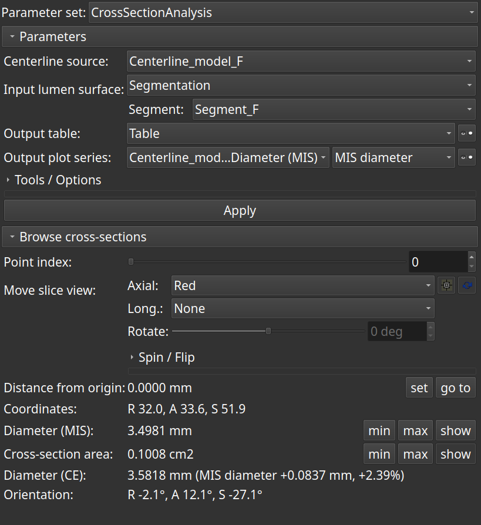

# Cross-section analysis

This module displays and quantifies cross-sections along a curve (VMTK centerline model, VMTK centerline markups curve, an arbitrary markups curve or a [Shape](https://github.com/chir-set/SlicerExtraMarkups/tree/main/Shape/) markups node as a Tube).

Main features:

- centre on the centerline point in slice view during browsing
- orthogonal slice view reformat
- spin the slice view by an arbitrary amount
- define an arbitrary centerline point as origin
- go to defined origin
- go to minimum and maximum MIS diameter
- go to minimum and maximum cross-section area
- show the maximum inscribed sphere
- show the cross-section

Computed metrics:

- distance of points from an arbitrarily defined origin
- RAS or LPS coordinates of the points
- maximum inscribed sphere (MIS) diameter, as computed by 'Extract centerline'
- cross-section area of a surface
- circular equivalent (CE) diameter, derived from the cross-section area
- orientation of a slice view

If a Shape node (Tube) is used as input, its invisible axial spline is the centerline and the wall is the arterial bounds. It allows to :

- determine the arterial cross-section surface area and diameter at each point
- relate to the lumen's measurements at each point, i.e, calculate the stenosis distribution.

## User interface

### Input centerline

VMTK centerline model and VMTK centerline markups curve have MIS radius scalars attached. Helper functions relative to the maximum inscribed sphere will the be operational.

This input may also be an arbitrary markups curve however. MIS scalars will not be available here.

### Input surface

A model or a segment may be an optional input. Cross-section area and its derived circular equivalent diameter will then be available at each point.

### Output table

An output table providing distance of points from relative centerline origin, MIS diameter, CE diameter and cross-section area at each point. Point coordinates are also recorded. The table's visibility can be easily toggled.

### Output plot

A graphical plot of MIS diameter, CE diameter or cross-section area against distance from relative origin can also be viewed.

## Notes

- The parameter set node is intended for distinct combinations of centerlines and surfaces to isolate a study.
- Point coordinates can be displayed as an array in a single column, or split in three distinct columns. One can choose between RAS or LPS coordinates.
- A markups curve may also lie outside a surface.
- Providing a surface (segmentation or model) is optional. For example, a markups curve may be drawn on a vascular structure's boundary in slice views, to see the corresponding cross-sections only.
- The meaning of a surface area is subject to its requirement. For tubular surfaces for instance, orthogonal section is a requirement.
- Reslicing can be performed as cross-section along the centerline, or in orthogonal planes at each centerline point (adjusted with the 'Spin' slider).
- When using a Shape node as a Tube :
    - the Tube should be nicely drawn, avoid kinking in particular,
    - the lumen should be cut to slightly exceed the ends of the Tube, remove all bifurcations and distant parts of the segment that are not enclosed in the Tube.
- The quality of a segmented lumen is important. It must not contain holes. These may be misleading as the calculated surface area may concern a hole and not the segmented blood. These defects may be identified and tracked in the module. For a segmentation lumen surface, the 'Paint' effect of the 'Segment editor' may be activated in-place to fill the holes. Alternatively, the input segment may be replaced by its largest region.

|                                                    |                                                    |
|----------------------------------------------------|----------------------------------------------------|
|||

## Acknowledgement

This module has been initiated by Saleem Edah-Tally (Surgeon, Hobbyist developer), developed throughout with expert coaching by Slicer core developer Andras Lasso, co-author.

