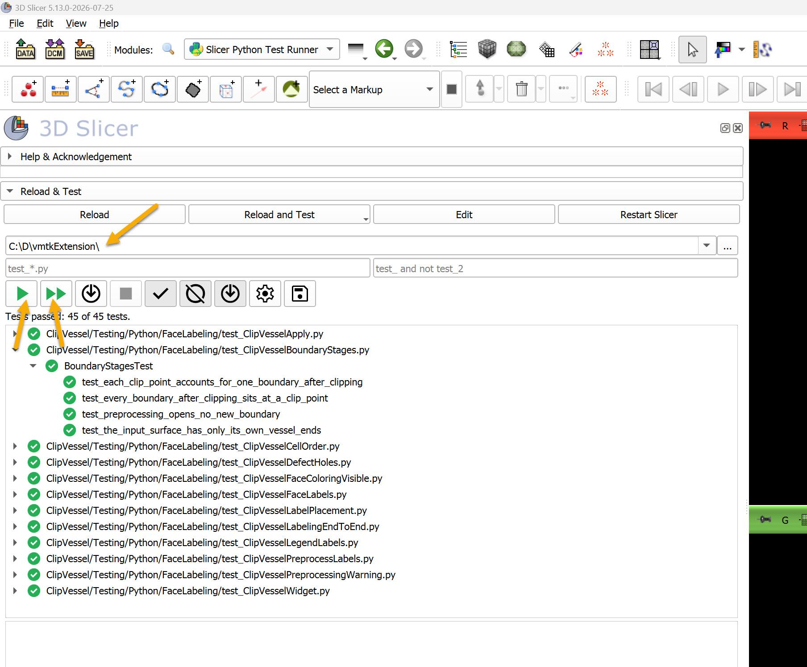

# Developer notes

Notes for developers of this Slicer extension.

## Build

Prerequisite: Build 3D Slicer.

```
SLICER_BUILD_DIR=/path/to/Slicer-SuperBuild
```

```
git clone git://github.com/vmtk/SlicerVMTK.git
mkdir SlicerVMTK-build/ && cd $_

EXTENSION_BUILD_DIR=`pwd`

cmake -DSlicer_DIR:PATH=$SLICER_BUILD_DIR/Slicer-build ../SlicerVMTK
make -j5
make package
```

## Running VMTK from the build tree

A plain Slicer knows nothing about an extension that has only been built, so the build generates
a launcher that starts Slicer with the built modules added. On Windows it is
`SlicerWithSlicerVMTK.exe` in the **inner build** directory (`SlicerWithSlicerVMTK` on Linux and
macOS); the name follows the extension, so a differently named extension gets its own.

Starting it runs the Slicer the extension was built against, passing
`--additional-module-paths` for the build's scripted, loadable and CLI module directories,
together with those of any extension this build was configured to depend on. The result is an
ordinary Slicer session in which the built modules are present, without installing anything into
Slicer or touching an installed copy of the extension. Its settings are in
`SlicerWithSlicerVMTKLauncherSettings.ini` next to it, rewritten by the build, so it is not a file
to edit by hand.

The modules it loads are the build's copies, not the source tree. Editing a module's `.py` under
the source tree therefore has no effect on a session started this way until the extension is
built again -- with the exception of the **Reload and Test** button below, which re-reads the file
it loaded the module from.

## Testing

There are three ways to run the tests: two from inside a running Slicer, and one from a build.

### The "Reload and test" button

Enable developer mode first: **Edit** > **Application Settings** > **Developer** >
**Enable developer mode**, then restart Slicer. Each scripted module then shows a
**Reload & Test** section at the top of its panel.

**Reload and Test** reloads the module's Python source and runs that module's own self test, so
an edit can be tried without restarting Slicer. It runs only the self test of the module in
front of you, not the rest of the suite. Progress and failures go to the Python console
(**View** > **Python Console**); a failing test raises, and the traceback appears there and in
the error log.

### The Slicer Python Test Runner module

Install the **SlicerPythonTestRunner** extension from the Extensions Manager and restart Slicer,
then open **Slicer Python Test Runner** (Developer Tools category).

Set the directory to the extension's source folder to run everything, or to one module's
`Testing` folder to run just that module. Then:

- **Green arrow** -- runs every test matching the patterns, sequentially, **all in one Slicer
  process**.
- **Double green arrow** -- runs the same tests **in parallel, each file in its own Slicer
  instance**.



The results appear as a tree that can be filtered to hide passed or skipped tests. A stop button
cancels a run in progress, and a third button lists the tests that match without running them.

Run both ways before pushing. They differ in more than speed: the sequential run puts every test
file in one process, so a test that leaves state behind -- in a module widget, in a module logic,
or in the scene -- can affect the tests that follow it. The parallel run gives each file a fresh
process and hides exactly that class of bug. A suite that passes in parallel and fails
sequentially has a leak between its tests, not a flaky test.

The parallel run starts Slicer with `--no-main-window`, so anything that needs a main window --
`slicer.util.selectModule()`, for one -- is unavailable there and has to be optional in a test.


### CTest

Unlike the two above, this one needs the extension to have been **built**: CTest runs the tests
that the build registered, against the copy of the module the build made. See [Build](#build)
above.

Run `ctest` from the extension's **inner build** directory -- the one holding the extension's own
`CMakeCache.txt`, not the top level of the superbuild, which has no tests registered in it at all:

```
cd <build directory>/inner-build
ctest -C Release --output-on-failure
```

`-C Release` is needed with a multi-config generator such as Visual Studio, and naming the wrong
configuration, or none, gives `Test not available without configuration` rather than a useful
error. On a single-configuration generator (Makefiles, Ninja) it can be left out.

`ctest -N` lists the tests without running them, `-R <regex>` runs the subset whose names match
(`ctest -C Release -R py_test_ClipVessel` for one module's suite), and `-j <n>` runs several at a
time. Each test is a separate Slicer process, so this behaves like the parallel run above rather
than the sequential one.

Remember that the build copies the Python modules into the build tree, and CTest runs those
copies. Editing a module's `.py` under the source tree and running CTest without rebuilding tests
the previous version, which passes or fails for reasons that have nothing to do with the edit.
Rebuild first.

### Running a single test by hand

From Slicer's Python console, where `__name__` is `__main__`, so the file's own entry point runs
its suite:

```
exec(open(r'.../ClipVessel/Testing/Python/test_ClipVesselCellOrder.py').read())
```

Or through CTest, by the name CMake gave it -- the test name is the file name with a `py_` prefix:

```
ctest -C Release -R py_test_ClipVesselCellOrder
```

Either way, start Slicer through the launcher described above: a test imports the module it
covers, which imports VMTK, and a Slicer started any other way will not find it. The Test Runner
spawns `SlicerApp-real.exe` rather than the launcher, but the child inherits the launcher's
environment, so it too finds VMTK as long as the Slicer it was started from was launched that way.

### Writing test scripts

Most tests are not self test Slicer modules. That would put them in Slicer's module
list, and it would not work with the SlicerPythonTestRunner: Slicer imports a scripted module at
startup, so pytest found the name already bound to the copy in the build tree and refused the
source file with an *import file mismatch*. Plain test files avoid both.

They are named `test_*.py` so pytest finds them with its default pattern, which also keeps it away
from `ClipVesselTestFixture.py`, which is imported by them rather than being a test itself.

Each file ends by running its own unittest suite and raising if anything failed, which is what
`slicer_add_python_test` reports through the exit code. pytest collects the same
`unittest.TestCase` classes directly, so the two ways of running them agree.
