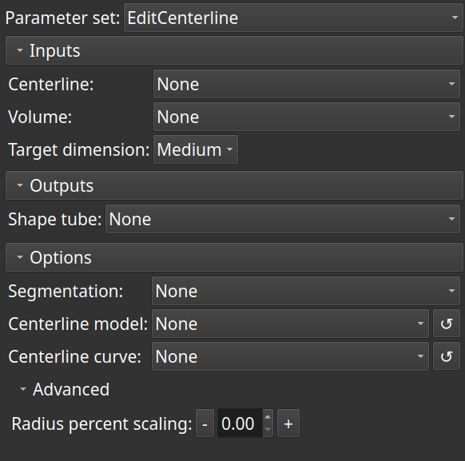

# Edit centerline

This module creates a Shape::Tube markups node along an input arbitrary markups curve that represents the axis of a non-aneurysmal artery, a centerline model or a centerline curve generated by the ExtractCenterline module. The control points of the tube can be further repositioned to represent the best *estimate* of the arterial wall.

It can also create a new centerline model and/or a new centerline curve corresponding to the central spline of the tube. The radius distribution of the tube can finally be scaled by a specified factor.

### Usage

For an input arbitrary curve, select a scalar volume of a CT angiogram and a target dimension profile. Select an output Shape::Tube node, and optionally a segmentation node to keep the segment mask.

For an input centerline model or an input centerline curve, select an output Shape::Tube node and the number of control point pairs for the Tube.

After applying, the resulting Tube node may be post-processed to reposition the control points on the arterial wall.

An optional output centerline model node and an optional output centerline curve node may also be specified. After updating the control point positions of the tube, these output centerlines may be updated selectively.

### Notes
This extension is a requirement: [ExtraMarkups](https://github.com/chir-set/SlicerExtraMarkups).

Use cropped volumes to save time.

For an arbitrary curve:

 - For tiny targets, resampling the volume to increase the resolution may help.
 - The input curve should represent the axis of the artery.
 - The control points of the input curve should preferably be evenly spaced.
 - For diseased arteries, the more the curve passes through calcifications and soft lesions, the better for the segment mask.
 - An output segmentation node can be specified to view the segment mask.

