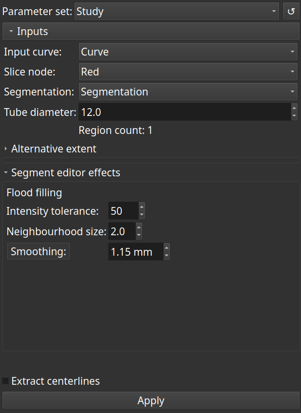

# Guided Artery Segmentation

This module is intended to create targeted segmentations from a contrast enhanced CT angio scan using a markups open curve, and to finally extract centerlines from the surface model. Overall, it's a small wrapper to create *short* arterial segments as *single* tubes, with subsequent centerline extraction.

It assumes that a markups curve control points are placed in the contrasted lumen.

The 'Flood filling' and 'Split volume' effects of the '[Segment editor extra effects](https://github.com/lassoan/SlicerSegmentEditorExtraEffects)' are used.

The '[Extract centerline](https://github.com/vmtk/SlicerExtension-VMTK/tree/master/ExtractCenterline/)' module is used for centerline extraction.

## User interface

### Input markups curve node

At least 3 control points are required. All control points must lie in the contrasted lumen, simulating the arterial axis. The first and last points will be endpoints to ‘Extract centerline’ module, and are not used for segmentation. It is therefore helpful that the second control point be reasonably close to the first point, and that the before last one be close to the last point. The input curve will be hidden if centerlines are requested.

### Input markups shape node

A Shape::Tube node can be used as region of interest. It can be drawn to represent the arterial wall. Lumen segmentation is then carried out inside this tube. If a Shape::Tube node is used, the tube diameter parameter below is ignored. This node is available in [ExtraMarkups](https://github.com/chir-set/SlicerExtraMarkups) extension.

### Input slice node

The 'Flood filling' effect will be applied at each point in this slice view. The current offset will be changed consequently.

### Output segmentation node

If no segmentation node is specified, one will be created, and it will persist across runs. An arbitrary segmentation node may also be provided. Segments will be added to the segmentation node, one for each input curve.

### Input tube diameter

This value should be slightly greater than the maximum estimated diameter of the artery.

### Parameters of the segment editor effects

*Flood filling*: Please refer to the manual of '[Segment editor extra effects](https://github.com/lassoan/SlicerSegmentEditorExtraEffects)' for their meaning. In brief, high values are needed for 'Intensity tolerance' with contrasted CT angiograms; increasing the value of 'Neighbourhood size' limits leakage during segmentation.

*Smoothing*: the 'Closing' operation of this effect can be optionally applied to remove holes in the segment.

### Extract centerlines

Check this to call the 'Extract centerline' module. It is optional by default because it make take much time, depending on the input surface. It is recommended to generate a segmentation first. Once it is considered reliable, generate a centerline model and a centerline curve as a last step.

## Notes

If the segment contains holes, the number of regions will be greater than one. This can be fixed with the provided function that replaces the segment with the largest identified region. If centerline extraction is requested, the latter fix can be applied on request.

## Acknowledgement

This module has been developed by Saleem Edah-Tally (Surgeon, hobbyist developer).
