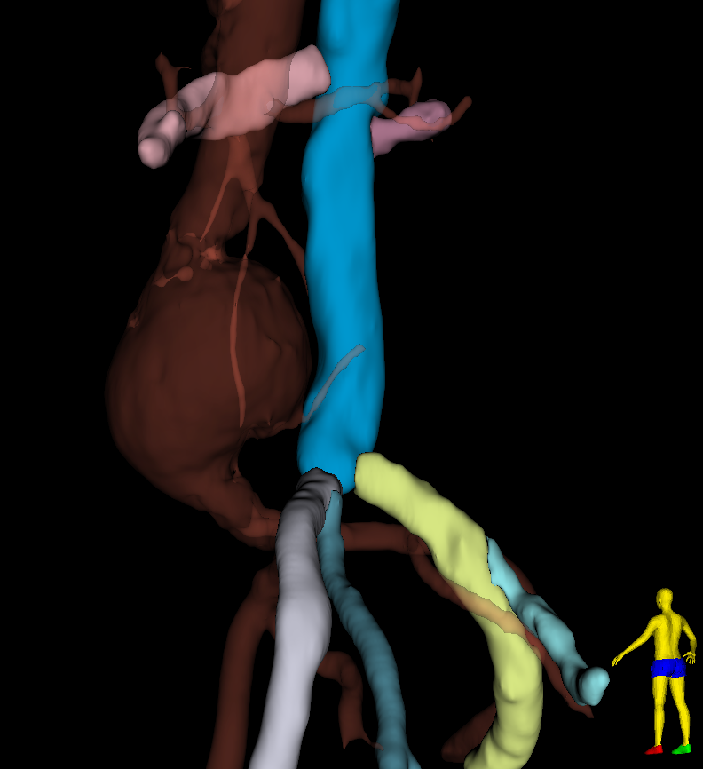
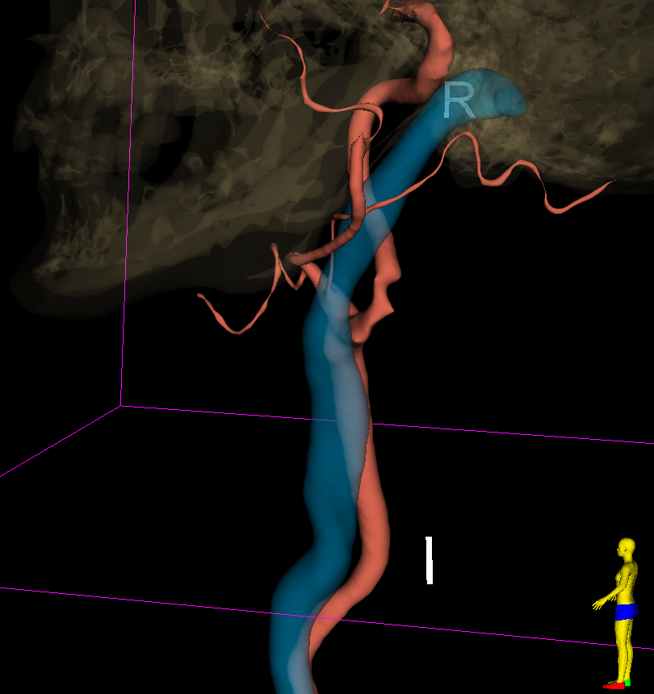

# Guided vein segmentation

This module attempts to segment *major* veins from CT scans using the 'Segment editor' effects.

### Usage

Draw an open markups curve along the axis of the vein. Select an input volume and a segmentation node.

The main parameters may be tuned according to the size of the target vein, considering that the default values target the inferior vena cava.

 - shell margin : the input curve path is expanded according to this margin,
 - extrusion kernel size : extrusions of the initial vein segment are removed accordingly,
 - Gaussian standard deviation : the vein segment is further smoothed per this value.

Secondary parameters should be rarely tuned :

 - shell thickness : the initial expanded segment is then hollowed to a shell with this outer thickness
 - seed radius : the dimension of the very first lumen and shell segments.

### Notes

 - Create anatomical segments, with homogeneus diameters, rather than one very long segment. They can be later merged with the 'Logical operators' effect.
 - Small veins may be beyond the scope of this work.
 - It is of interest to segment nearby structures like arteries and bones first. The vein segments may overlap these. If 'Remove overlaps' is in effect, the intersection between the vein segments and the segmented surroundings will be removed.
 - The vein is not segmented with 100% accuracy. Verification can be performed by removing 'Slice fill' for the segment, keeping the outline.
 - Bulging may be the departure of branches or excessive localised segmentation.
 - The result of the very first run may indicate tuning until a satisfactory result is obtained.

### Disclaimer

Use at your own risks.

