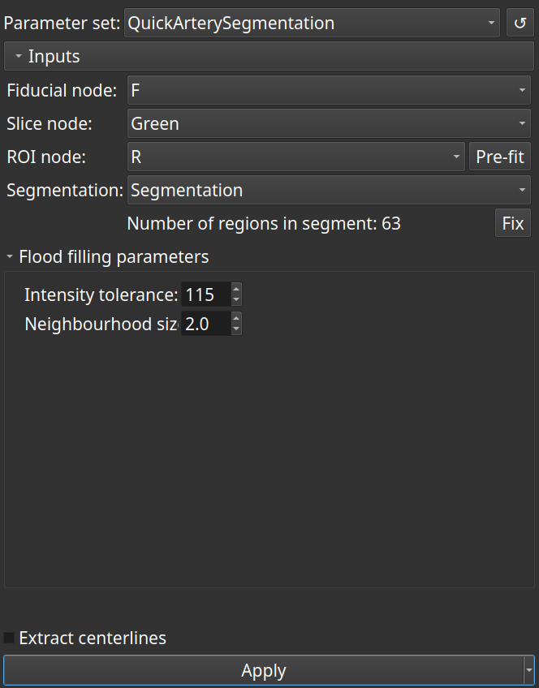

# QuickArterySegmentation module

This module is intended to create targeted (small) segmentations from a contrast enhanced CT angioscan using fiducial points, and to finally extract centerlines from the surface model. Overall, it's a small wrapper for common arterial segmentation tasks.

It assumes that data acquisition of the input volume is nearly perfect, and that fiducial points are placed in the contrasted lumen.

The 'Flood filling' effect of the '[Segment editor extra effects](https://github.com/lassoan/SlicerSegmentEditorExtraEffects)' is used for segmentation.

The '[Extract centerline](https://github.com/vmtk/SlicerExtension-VMTK/tree/master/ExtractCenterline/)' module is used for centerline extraction.

**Input fiducial node**

At least 2 points are required. All points must lie in the contrasted lumen.

**Input slice node**

The 'Flood filling' effect will be applied at each point in this slice view. The current offset will be changed consequently.

**Input ROI node**

An ROI must be used to limit the segmentation. Using an ROI may save time, both during segmentation and during centerline extraction. A helper button pre-fits the ROI bounds to that of the input fiducial node. Manual resizing of the ROI is *unavoidable* to enclose the anatomical region of interest.

**Output segmentation node**

If no segmentation node is specified, one will be created, and it will persist across runs. An arbitrary segmentation node may also be provided. Segments will be added to the segmentation node, one for each input fiducial.

**Flood filling parameters**

Please refer to the manual of '[Segment editor extra effects](https://github.com/lassoan/SlicerSegmentEditorExtraEffects)' for their meaning. In brief, high values are needed for 'Intensity tolerance' with contrasted CT angiograms; increasing the value of 'Neighbourhood size' prevents leakage during segmentation.

**Extract centerlines**

Check this to call the 'Extract centerline' module. It is optional by default because it make take much time, depending on the input surface. It is recommended to generate a segmentation first. Once it is considered reliable, generate a centerline model and a centerline curve as a last step.

**Notes**

If the segment contains holes, the number of regions will be greater than one. This can be fixed with the provided function that replaces the segment with the largest identified region. If centerline extraction is requested, the latter fix can be applied on request.

## Acknowledgement

This module has been developed by Saleem Edah-Tally (Surgeon, hobbyist developer).

