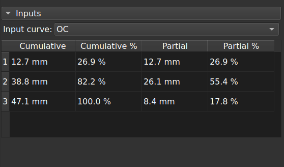
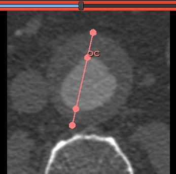

# One dimensional stenosis measurement

This [Slicer](https://www.slicer.org/) module straightens an input markups curve and displays cumulative and individual lengths between control points. It is intended for quick one dimensional arterial stenosis evaluation, but is actually purpose agnostic.

**Usage**

Select a markup curve. Add, delete or move control points.

In practice, orient a slice view perpendicular to an arterial axis by any means. Create a markups curve with control points at boundaries of plaque, thrombus, calcification, lumen and peripheral wall. When the curve is selected, it is straightened. Absolute and proportional distances between points next populate an output table. It is updated upon control point displacement.

