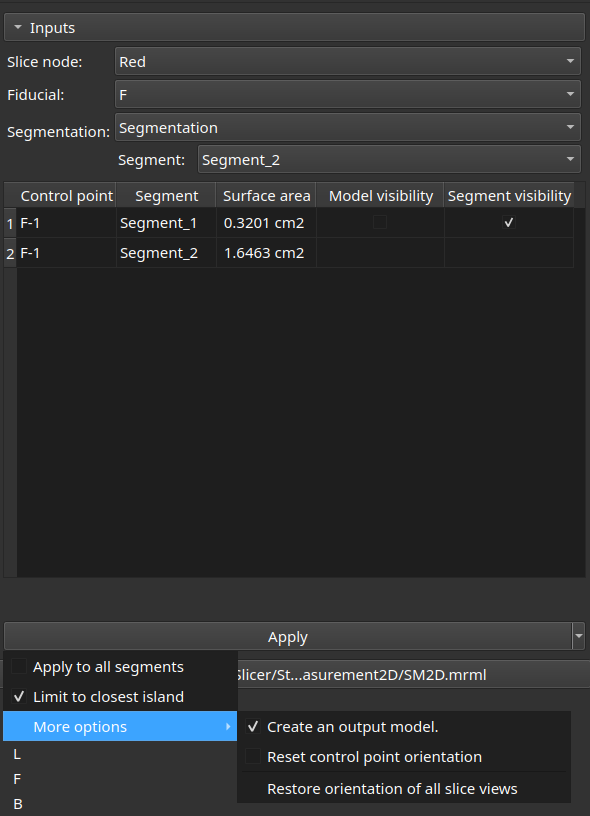
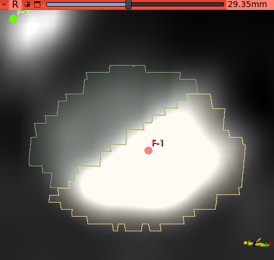

# Two dimensional stenosis measurement

This [Slicer](https://www.slicer.org/) module calculates segment surface area cut by a slice plane. It is intended for quick two dimensional arterial stenosis evaluation, but is actually purpose agnostic.

**Usage**

Create segments and reformat a slice view by any means. Place a fiducial point in the slice view. Click on the fiducial point to record the slice orientation, and apply.

Move to another location, reformat again, place another fiducial point and restart as above.

Jumping to a ficucial point will reset the slice orientation as recorded.

**Helper functions**

. The 'Options' collapsible pane allows to :

- precise if the selected segment or all segments should be handled,
- precise if all islands of a segment should be handled or only the one closest to the fiducial point,
- reset the recorded slice orientation of a fiducial point,
- precise if a model is created to view the surface from which the area is calculated,
- restore all slice views to their default orientation.

To reset the recorded slice orientation of a fiducial point, check the 'Reset' widget and click on a fiducial point. The next click on that fiducial point will record the current slice orientation. This allows to reformat a slice view again and record the current orientation.

. The 'Result table' allows to :

- remove the selected row and its referenced output model (contextual menu),
- empty the table (contextual menu),
- show/hide the input segments and output models.

**In practice**

Orient a slice view perpendicular to the axis of a diseased artery by any means. If the lumen has not been segmented yet, draw a lumen segment using 'Scissors', with 'Fill inside', 'Symmetric' and 2 mm thickness. Likewise, draw a second segment using the arterial wall as perimeter. Then continue with a fidicial point as described above.

**Notes**

- The calculated area is influenced by the smoothing factor of the 3D representation of the segments. For accurate results, disable segment surface smoothing temporarily.
- If a segment has a 'doughnut' shape, and 'Limit to closest island' is chosen, fiducial point placement is important. If it is close to the inner perimeter, the resulting surface will be the central hole only. If the control point is near to the outer perimeter, the resulting surface will include the central hole. Showing the created model helps to better understand what is being measured.

