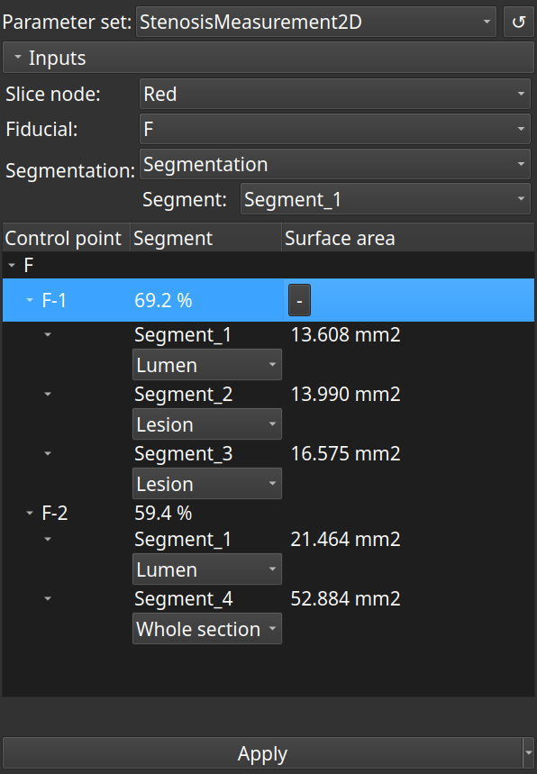
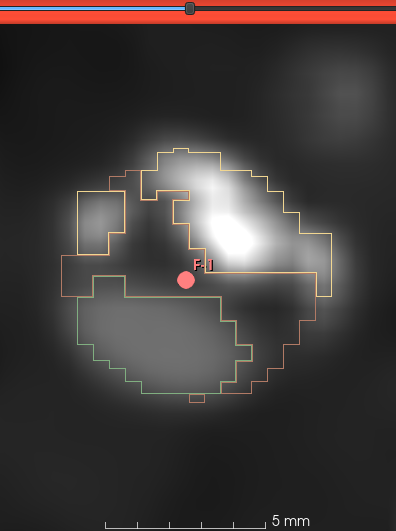

# Two dimensional stenosis measurement

This [Slicer](https://www.slicer.org/) module calculates segment surface area cut by a slice plane. It is intended for quick two dimensional arterial stenosis evaluation, but is actually purpose agnostic. The stenosis degree can be calculated by specifying consistent measurement categories.

**Usage**

Create segments and reformat a slice view by any means. Place a fiducial point in the slice view. Click on the fiducial point to record the slice orientation, and apply.

Move to another location, reformat again, place another fiducial point and restart as above.

Jumping to a ficucial point will reset the slice orientation as recorded.

**Helper functions**

The 'Apply' button can show an 'Options' menu that allows to :

- precise if the selected segment or all segments should be handled,
- precise if all islands of a segment should be handled or only the one closest to the fiducial point,
- reset the recorded slice orientation of a fiducial point,
- precise if a model is created to view the surface from which the area is calculated,
- restore all slice views to their default orientation.

To reset the recorded slice orientation of a fiducial point, check the 'Reset' menu item and click on a fiducial point. The next click on that fiducial point will record the current slice orientation. This allows to reformat a slice view again and record the current orientation.

The 'Result tree table' allows to :

- remove any row and its siblings,
- show/hide the input segments and output models from a menu in each measurement row,
- assign a measurement to a category (lumen, lesion, whole section or N/A) to calculate the stenosis degree.

**In practice**

Orient a slice view perpendicular to the axis of a diseased artery by any means. If the lumen has not been segmented yet, draw a lumen segment using 'Scissors', with 'Fill inside', 'Symmetric' and 2 mm thickness. Likewise, draw a second segment showing the arterial wall as perimeter. Then continue with a fiducial point as described above.

**Notes**

- The calculated area is influenced by the smoothing algorithm and the smoothing factor of the 3D representation of the segments, the resolution of the input volume and the resolution of the segmentation.

## Acknowledgement

This module has been developed by Saleem Edah-Tally (Surgeon, hobbyist developer), with the help of Andras Lasso (PerkLab).

