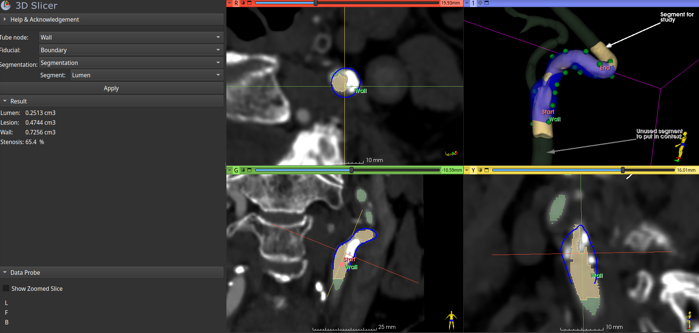

# Three dimensional stenosis measurement

This [Slicer](https://www.slicer.org/) module calculates arterial stenosis degree in 3D. It requires the custom [Shape](https://github.com/chir-set/ExtraMarkups/) markups as a tube.

**Usage**

Segment a diseased arterial lumen using the segment editor. Draw a best fit arterial wall around the lumen using the Tube (Shape) markups. This is not a computed step, but totally observer dependent. It is more accurately done in slice views in these ways:

 - proceed with many manual reformatting so as to be perpendicular to the arterial axis prior to placing a pair of points in one slice view (activate 'Slice intersections', use 'Ctrl+Alt+LeftClickDrag' and/or 'Interaction'),
 
 - use a temporary open curve markups node: place each point of the curve at best estimates of the artery's anatomical axis; use 'Cross-section analysis' module to browse a resliced view along the curve; place pairs of control points of the Shape::Tube node at significant intervals during browsing; the open curve node can then be hidden or removed;
 
 - place pairs of control points of the Shape::Tube in a 'Volume rendering' view along the artery, click on successive control points and reslice to the active control point each time in the Markups module widget; this will reslice the selected view such that both elements of a pair of control points of the Shape::Tube node can be repositioned accurately to the best estimate of the artery's walls;

 - use '[Edit centerline](https://github.com/vmtk/SlicerExtension-VMTK/blob/master/Docs/EditCenterline.md)' module.

Place 2 points of a fidicial node to limit the extent of the study.

**Options**

 - Show a model of the surfaces being cut down and measured.
 - Store the results in a table

**Notes**

 - A small part of the drawn tube is excluded at each end during processing; the boundary points do not extend in the excluded parts.
 - This project is tentative: arterial stenosis evaluation by volume is not a current clinical practice. Modern digital tools allow such measurements. The meaning of the calculated results may yet be researched:
     - wall volume
     - lumen volume
     - lesion volume
     - stenosis degree by volume
     - lesion volume per cm
     - stenosis per cm.
