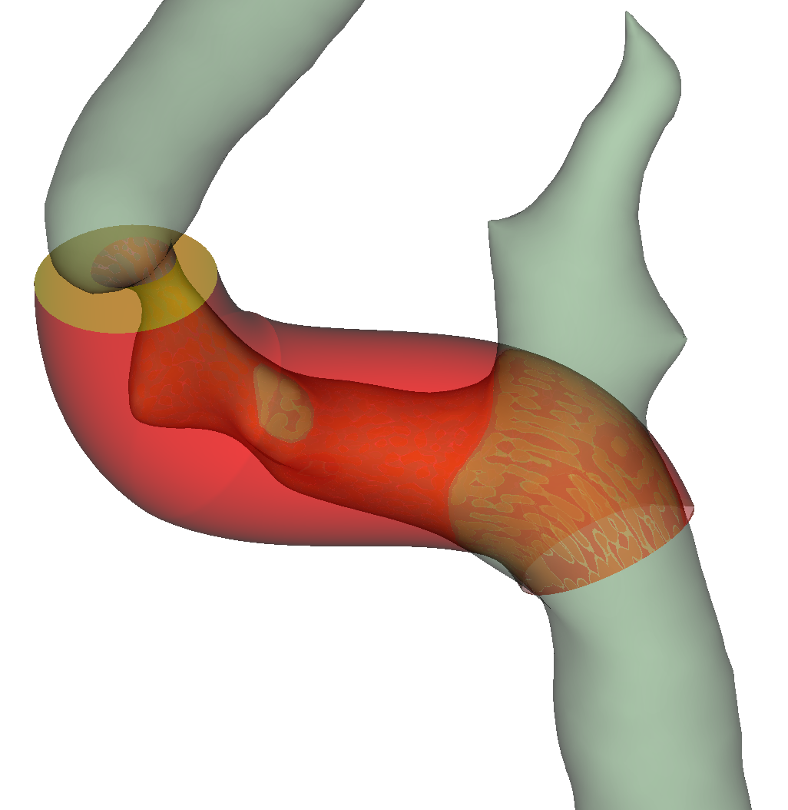

# Three dimensional stenosis measurement

This [Slicer](https://www.slicer.org/) module calculates arterial stenosis degree in 3D. It requires the custom [Shape](https://github.com/chir-set/ExtraMarkups/) markups as a tube.

**Usage**

Segment a diseased arterial lumen using the segment editor. Draw a best fit arterial wall around the lumen using the Tube (Shape) markups. This is not a computed step, but totally observer dependent.

 - Point placement of a Tube can be manually performed in different ways, refer to some [helper videos](https://github.com/chir-set/SlicerExtraMarkups/blob/main/Shape/README.md) in the 'Tube' section of this page.

 - Alternatively, use the '[Edit centerline](https://github.com/vmtk/SlicerExtension-VMTK/blob/master/Docs/EditCenterline.md)' module to *pre-define* a Tube.

Place 2 points of a fiducial node to limit the extent of the study.

The input segment should be a contiguous segment without any holes. If these are detected, they can removed with the provided smoothing facility.

**Options**

 - Show a model of the lesion.
 - Store the results in a table
 - Decimate the input Tube surface

**Notes**

 - A small part of the drawn tube is excluded at each end during processing; the boundary points do not extend in the excluded parts.
 - This project is tentative: arterial stenosis evaluation by volume is not a current clinical practice. Modern digital tools allow such measurements. The meaning of the calculated results may yet be researched:
     - wall volume
     - lumen volume
     - lesion volume
     - stenosis degree by volume
     - lesion volume per cm
     - stenosis per cm.
 - A cache of the enclosed lumen is used for faster subsequent processing. It is transparently invalidated on many events. However, Undo/Redo operations in the 'Segment editor' are not detected. In such circumstances, the cache *must* be explicitly cleared, either using the provided menu action or by changing any input node back and forth. As for the tube, any modified event invalidates the cache.
 - If the processing fails, check the pre-processing (decimate) button for the Tube and repeat.
