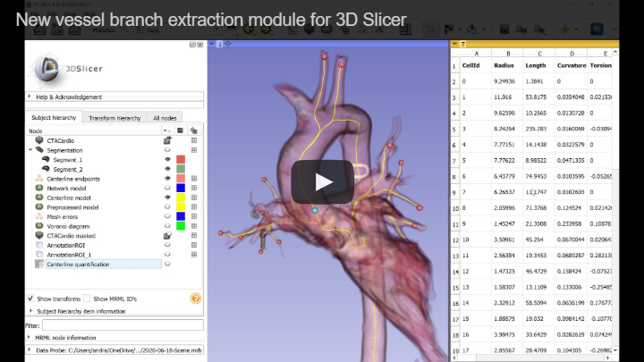
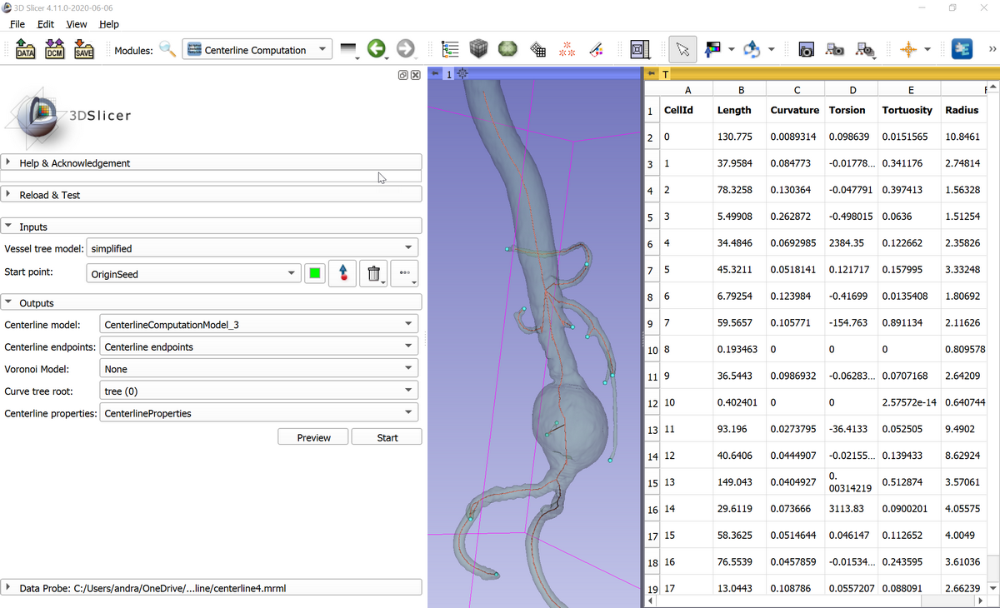

The VMTK Extension for 3D Slicer
--------------------------------

This extension makes the Vascular Modeling Toolkit (VMTK, http://www.vmtk.org/) available in 3D Slicer (www.slicer.org). Features include vessel tree segmentation and centerline extraction. Short demo video of vessel segmentation and centerline extraction is available here: https://youtu.be/caEuwJ7pCWs

[](https://www.youtube.com/watch?v=yi07mjr3JeU)

# Installation

VMTK extension is available for recent 3D Slicer versions 4.10 and above. Install 3D Slicer, start 3D Slicer, and in the extension manager install SlicerVMTK extension.

# Usage

SlicerVMTK extension provides the following modules:

- Segmentation:
  - Vesselness Filtering: Image processing operation that increases brightness of tubular structures and suppresses other shapes (plates and blobs). This module can be used to pre-process image data to make vessel segmentation easier.
  - Level Set Segmentation: This module can segment a *single vessel branch* of a vessel tree from an image (either unprocessed or vesselness-filtered can be used). Place "Seeds" points inside vessels and place "Stoppers" points in areas to avoid (where segmentation leaked out to). To segment multiple branches, you can use Segment Editor module.
- Analysis:
  - [Extract Centerline](Docs/ExtractCenterline.md): Determine centerlines in a vessel tree from an input segmentation or model. It can either do quick network extraction or an accurate centerline computation and branch extraction between designated endpoints. The module can simplify the input to make computations fast (typically 5-20 seconds) without significant decrease in accuracy and can also detect and mark mesh errors (non-manifold edges).
  - [Cross-Section Analysis](Docs/CrossSectionAnalysis.md): Reslice images, segmentations, or models along a centerline curve. It can measure cross-sectional area and various other metrics and displays it as a table or plot.
- Workflows:
  - [Guided Artery Segmentation](Docs/GuidedArterySegmentation.md): Create targeted segmentations from a contrast enhanced CT angio scan using a markups open curve, and to finally extract centerlines from the surface model. Overall, it's a small wrapper to create *short* arterial segments as *single* tubes, with subsequent centerline extraction.
  - [Quick Artery Segmentation](Docs/QuickArterySegmentation.md): Create targeted (small) segmentations from a contrast enhanced CT angio scan using fiducial points, and to finally extract centerlines from the surface model. Overall, it's a small wrapper for common arterial segmentation tasks.
  - [Stenosis measurement 1D](Docs/StenosisMeasurement1D.md): use distances between control points of a straightened open curve to evaluate a stenosis.
  - [Stenosis measurement 2D](Docs/StenosisMeasurement2D.md): use segment surface areas to evaluate a stenosis.
- Legacy modules (replaced by other modules, not developed anymore):
  - [Centerline Computation](Docs/CenterlineComputation.md): This module determines centerlines in a vessel tree from an input model node. *This module is replaced by the much improved, faster and more robust "Extract Centerline" module in current Slicer versions (Slicer-4.11 and later).*



# Advanced analysis

Results can quantitatively analyzed in Slicer's virtual Python environment (or by implementing custom Slicer modules).

## Examples

Get centerline point coordinates and radii as numpy array and print them:

```python
c = getNode('CenterlineComputationModel')
points = slicer.util.arrayFromModelPoints(c)
radii = slicer.util.arrayFromModelPointData(c, 'Radius')
for i, radius in enumerate(radii):
  print("Point {0}: position={1}, radius={2}".format(i, points[i], radius))
```

Get centerline points and lines as VTK object:

```python
centerlineModel = getNode('CenterlineComputationModel')
centerlinePoly = centerlineModel.GetPolyData()

# Get first point position:
print(centerlinePoly.GetPoints().GetPoint(0))

# Get point IDs of the first line segment
pointIds = vtk.vtkIdList()
centerlinePoly.GetLines().GetCell(0, pointIds)
```

# For developers

## Compilation

```
SLICER_BUILD_DIR=/path/to/Slicer-SuperBuild
```

```
git clone git://github.com/vmtk/SlicerVMTK.git
mkdir SlicerVMTK-build/ && cd $_

EXTENSION_BUILD_DIR=`pwd`

cmake -DSlicer_DIR:PATH=$SLICER_BUILD_DIR/Slicer-build ../SlicerVMTK
make -j5
make package
```

## Start Slicer and detect the VMTK extension

```
$SLICER_BUILD_DIR/Slicer \
  --launcher-additional-settings \
  $EXTENSION_BUILD_DIR\inner-build\AdditionalLauncherSettings.ini \
  --additional-module-paths \
  $EXTENSION_BUILD_DIR/inner-build/lib/Slicer-4.3/qt-loadable-modules \
  $EXTENSION_BUILD_DIR/inner-build/lib/Slicer-4.3/qt-scripted-modules
```
