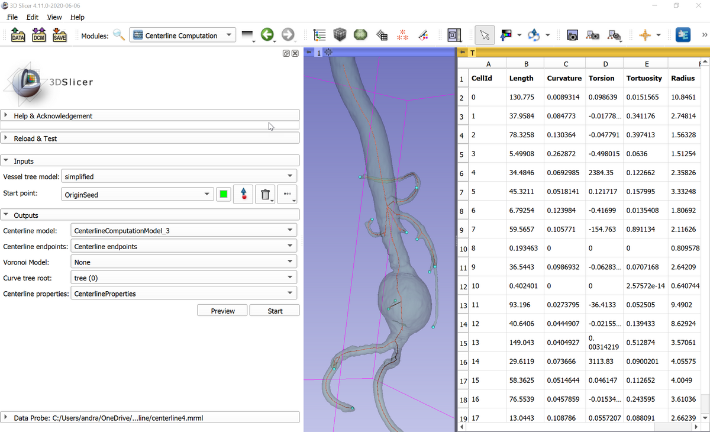

The VMTK Extension for 3D Slicer
--------------------------------

This extension makes the Vascular Modeling Toolkit (VMTK, http://www.vmtk.org/) available in 3D Slicer (www.slicer.org). Features include vessel tree segmentation and centerline extraction. Short demo video of vessel segmentation and centerline extraction is available here: https://youtu.be/caEuwJ7pCWs

[](https://www.youtube.com/watch?v=yi07mjr3JeU)

# Installation

VMTK extension is available for recent 3D Slicer versions (Slicer-4.10 and above). Install 3D Slicer, start 3D Slicer, and in the extension manager install SlicerVMTK extension.

# Usage

SlicerVMTK extension provides the following modules - listed in in Vascular Modeling Toolkit category in the module list.

## Vesselness Filtering

Image processing operation that increases brightness of tubular structures and suppresses other shapes (plates and blobs). This module can be used to pre-process image data to make vessel segmentation easier.

## Level Set Segmentation

This module can segment a *single vessel branch* of a vessel tree from an image (either unprocessed or vesselness-filtered can be used).

## Extract Centerline

Determine centerlines in a vessel tree from an input segmentation or model node. It can either do quick network extraction or an accurate centerline computation and branch extraction between designated endpoints. The module can simplify the input to make computations fast (typically 5-20 seconds) without significant decrease in accuracy and can also detect and mark mesh errors (non-manifold edges).

### Preprocessing

The module requires a surface mesh as input (specified in either model or segmentation node). The mesh is typically created by segmenting images and therefore very dense, containing very high number of points. Using all the points in the centerline extraction would make the computation time very long (several minutes to tens of minutes). Preprocessing steps built into the module simplify the input mesh by replacing many small mesh elements with larger ones in regions where the curvature of the surface is low. This simplification reduces number of points and thus computation time, without significant changes in the computation result.

Preprocessing is enabled by default and it aims for reducing the number of mesh points to 5k (=5000). For larger, more complex networks, this `Target point count` parameter values can be increased (up to about 100k should be enough for most cases). Simplification is not performed in high-curvature areas, as it could remove significant features from the mesh and/or may introduce mesh errors (such as non-manifold edges). `Aggressiveness` parameter controls how much change in the mesh is acceptable during simplification. If aggressiveness value is low then all features of the mesh are preserved and no mesh errors are introduced but it may prevent the simplification method to reach the desired target point reduction. Any positive value can be used for aggressiveness, but values between 3.5-4.5 work best for typical inputs.

`Subdivide` can be enabled to increase the number of input points. This may make computation more robust for input meshes that has very coarse resolution

If a node is specified in `Output preprocessed surface` then preprocessing result is saved in that node. This is useful for quality checks: to ensure that all important details of the mesh are preserved. Saving preprocessed surface can be used to reduce computation time for repeated centerline extractions: once the preprocessed mesh is computed, choose it as input `Surface` and disable `Preprocess input surface`.

### Network extraction

Network extraction can be used for quick, approximate extraction of a complete centerline network. It is invoked automatically when Endpoints "Auto-detect" button is clicked or a node is selected as "Network model" output.

Computation requires `Surface` input and an optional starting point. If no starting point is defined then closest point to one of the corners of the model is chosen. A centerline segment may appear between the starting point and the centerline network. To avoid this small extra branch, a starting point can be defined manually by placing an `Endpoint` markup point at end of any of the branches.

### Centerline tree extraction

Accurate, Voronoi model based centerline tree extraction can be performed by specifying an input `Surface` and `Endpoints`.

`Endpoints` are a list of branch endpoints that will be connected by centerlines. An endpoint can be inlet or outlet type by making the corresponding markup point "unselected" or "selected", respectively. Typically one inlet point is enough, but if the network consists of several independent trees then an inlet point should be defined in each tree. If no inlet point is designated then the first endpoint will be used as inlet. If an endpoint is not reachable then it may be connected to other points via a straight line. Remove or reposition these endpoints to create a complete, valid centerline network.

Extracted centerlines are saved into a model node if a model node is selected as `Centerline model`.

If a markups curve node is selected as `Centerline curve` then branches are split into separate curve nodes. Geometrical properties (length, average radius, curvature, torsion, tortuosity) are computed if a table node is chosen as `Quantification results`. Tortuosity is computed as the ratio between the centerline length and the distance of the line endpoints. Important: make sure that all endpoints are reachable (none of them are connected with a straight line to some other points in the tree), as unreachable endpoints may make computation run endlessly.

`Voronoi diagram` is a surface similar to medial surface, which is used for searching path between branch endpoints. This model can be saved for quality checks and for getting a surface where branch endpoints can be robustly placed on.

### Mesh error check

Mesh errors, such as non-manifold edges may cause errors during centerline computation. Non-manifold edges can be marked on the image by choosing a markups node as `Mesh error check results`.

## Centerline Computation module (legacy)

*This module is replaced by the much improved, faster and more robust "Extract Centerline" module in current Slicer versions (Slicer-4.11 and later).*

This module determines centerlines in a vessel tree from an input model node. Click "Preview" button for a quick validation of the input model and approximate centerline computation. Click "Start" button for full network analysis and computation of all outputs.

Required inputs:
- Vessel tree model: this can be any tree structure (not just vascular tree but airways, etc.), either created in Segment Editor module or using Level Set Segmentation module. If Segment Editor is used then segmentation node must be exported to model node by right-clicking on the segmentation in Data module and selecting "Export visible segments to models".
- Start point: a markups fiducial node containing a single point, this should be placed at the branch of the tree

Outputs:
- Centerline model: network extraction results (without branch extraction and merging). Points contain centerline points, and "Radius" point data contains maximum inscribed sphere radius at each point.
- Centerline endpoints: Coordinates of found start point and all detected branch endpoints.
- Voronoi model (optional): medial surface of the input model (medial surface contains points that are qat equal distance from nearest surface points)
- Curve tree rool (optional): if a markups curve node is selected then a hierarchy of curve nodes are created from extracted and merged branches. CellId of each branch is saved into the node's name (and also as node attribute), which can be used for cross-referencing with CellId column of centerline properties table.
- Centerline properties (optional): if a table node is selected then branch length, average radius, curvature, torsion, and tortuosity is computed for all the extracted and merged branches.



# Advanced analysis

Results can quantitatively analyzed in Slicer's Python interactor (or by implementing custom Slicer modules).

## Examples

Get centerline point coordinates and radii as numpy array and print them:

```python
c = getNode('CenterlineComputationModel')
points = slicer.util.arrayFromModelPoints(c)
radii = slicer.util.arrayFromModelPointData(c, 'Radius')
for i, radius in enumerate(radii):
  print("Point {0}: position={1}, radius={2}".format(i, points[i], radius))
```

Get centerline points and lines as VTK object:

```python
centerlineModel = getNode('CenterlineComputationModel')
centerlinePoly = centerlineModel.GetPolyData()

# Get first point position:
print(centerlinePoly.GetPoints().GetPoint(0))

# Get point IDs of the first line segment
pointIds = vtk.vtkIdList()
centerlinePoly.GetLines().GetCell(0, pointIds)
```

# For developers

## Compilation

```
SLICER_BUILD_DIR=/path/to/Slicer-SuperBuild
```

```
git clone git://github.com/vmtk/SlicerVMTK.git
mkdir SlicerVMTK-build/ && cd $_

EXTENSION_BUILD_DIR=`pwd`

cmake -DSlicer_DIR:PATH=$SLICER_BUILD_DIR/Slicer-build ../SlicerVMTK
make -j5
make package
```

## Start Slicer and detect the VMTK extension

```
$SLICER_BUILD_DIR/Slicer \
  --launcher-additional-settings \
  $EXTENSION_BUILD_DIR\inner-build\AdditionalLauncherSettings.ini \
  --additional-module-paths \
  $EXTENSION_BUILD_DIR/inner-build/lib/Slicer-4.3/qt-loadable-modules \
  $EXTENSION_BUILD_DIR/inner-build/lib/Slicer-4.3/qt-scripted-modules
```
